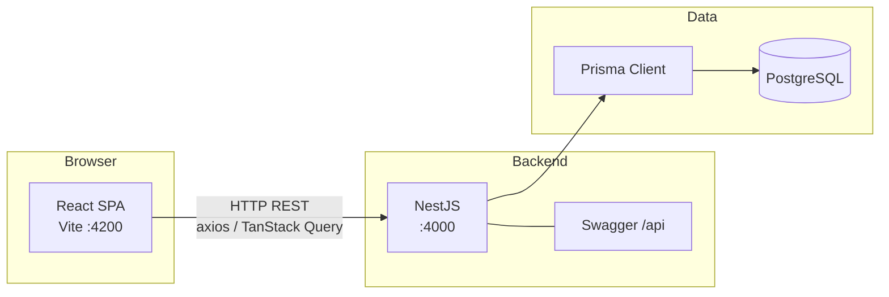

# Money Banking — Financial Planner

Nx monorepo for a **personal finance planner**: track balance, funds, transactions, goals, cards, subscriptions, and related history. The UI is a React single-page app that talks to a NestJS REST API backed by **PostgreSQL** via Prisma.

This README is meant for **new contributors** cloning the repo on GitHub.

---

## What’s in the box

| Area | Purpose |
|------|---------|
| **Dashboard & analytics** | Overview of money movement and balances |
| **Funds & reasons** | Bucket money by reason; tie spending/saving to categories |
| **Transactions** | Income, expense, and fund movements with optional card linkage |
| **Goals** | Savings/limit goals tied to reasons |
| **Current balance & history** | Live balance and historical snapshots |
| **Subscriptions** | Recurring charges with frequency and payment method |
| **Cards** | Payment methods used by transactions and subscriptions |

API documentation is served by **Swagger** at [`http://localhost:4000/api`](http://localhost:4000/api) when the backend is running.

---

## Architecture & request flow



1. **Frontend** (`apps/frontend`) runs on **port 4200** (Vite dev server).
2. **Backend** (`apps/backend`) listens on **port 4000** and enables **CORS** for `http://localhost:4200`.
3. **Shared types / validation** live in `libs/common` (Zod schemas and related helpers) so front and back can align on shapes.
4. **Database schema & migrations** live in `libs/prisma-schema`; Prisma generates the client used by the Nest **PrismaModule**.

---

## Tech stack

### Workspace & tooling

- **[Nx](https://nx.dev)** — monorepo tasks, caching, and project graph (`npx nx graph`)
- **TypeScript**
- **ESLint**, **Prettier**, **Jest** / **Vitest**, **Cypress** (e2e apps present under `apps/*-e2e`)

### Backend (`apps/backend`)

- **[NestJS](https://nestjs.com/)** — modular HTTP API (`Funds`, `Transaction`, `Reasons`, `Goal`, `History`, `CurrentBalance`, `Card`, `Subscription`, …)
- **[Prisma](https://www.prisma.io/)** — ORM and migrations (schema under `libs/prisma-schema`)
- **PostgreSQL**
- **[Swagger](https://docs.nestjs.com/openapi/introduction)** — OpenAPI UI at `/api`
- **class-validator** (where used on DTOs)

### Frontend (`apps/frontend`)

- **React 18** + **TypeScript**
- **[Vite](https://vitejs.dev/)** — dev server and production build
- **[Material UI (MUI) v6](https://mui.com/)** — layout, inputs, **MUI X** Data Grid, charts, date pickers
- **[TanStack Query](https://tanstack.com/query)** — server state and caching
- **[React Router](https://reactrouter.com/)** — client-side routing (e.g. Dashboard, Savings/Deposit, Billing/Planner, Settings)
- **[React Hook Form](https://react-hook-form.com/)** + **[Zod](https://zod.dev/)** — forms and validation
- **Axios** — HTTP client (`src/api/apiClient.ts` and related hooks/services)

### Shared libraries

| Library | Role |
|---------|------|
| `libs/common` | Shared schemas/DTOs (e.g. transaction, funds, goals, cards) |
| `libs/react-components` | Reusable React UI (e.g. dialog context provider used in `main.tsx`) |
| `libs/prisma-schema` | `schema.prisma`, migrations, seed |

---

## Repository layout (high level)

```
apps/
  backend/          NestJS API
  frontend/         React + Vite SPA
  backend-e2e/      API E2E (Jest)
  frontend-e2e/     UI E2E (Cypress)
libs/
  common/           Shared TypeScript contracts / Zod
  prisma-schema/    Prisma schema & migrations
  react-components/ Shared React components
```

---

## Prerequisites

- **Node.js** (LTS recommended; align with what your team pins in CI)
- **npm** (this repo uses `package-lock.json`)
- **PostgreSQL** running locally or reachable from your machine

---

## Getting started

### 1. Install dependencies

From the workspace root (`my-workspace/`):

```sh
npm install
```

### 2. Configure the database

Prisma reads the connection from `libs/prisma-schema/prisma/schema.prisma` (`datasource db`). Point it at **your** PostgreSQL instance (database, user, password, host, port, and optional `schema=`).

Then apply migrations and generate the client:

```sh
npx nx run prisma-schema:migrate
npx nx run prisma-schema:generate-types
```

(Optional) Seed sample data if you use the seed script:

```sh
npx nx run prisma-schema:db-seed
```

> **Tip:** For a quick inner loop you may use `npx nx run prisma-schema:db-push`, but prefer **`migrate`** for anything you intend to share or deploy.

### 3. Run the backend

```sh
npx nx serve backend
```

- API: [`http://localhost:4000`](http://localhost:4000)
- Swagger: [`http://localhost:4000/api`](http://localhost:4000/api)

### 4. Run the frontend

In another terminal:

```sh
npx nx serve frontend
```

- App: [`http://localhost:4200`](http://localhost:4200)

The SPA is configured to call the API at **`http://localhost:4000`** (see `apps/frontend/src/api/apiClient.ts` and related services). If you change ports or deploy behind another origin, update those URLs and the backend **CORS** settings in `apps/backend/src/main.ts`.

---

## Common Nx commands

| Goal | Command |
|------|---------|
| Project graph | `npx nx graph` |
| Backend build | `npx nx build backend` |
| Frontend build | `npx nx build frontend` |
| Lint / test (per project) | `npx nx show project <name>` then run listed targets |

See also: [Running tasks in Nx](https://nx.dev/features/run-tasks).

---

## CI note

`nx.json` references **`azure-pipelines.yml`** in shared inputs; align pipeline changes with that file if you use Azure DevOps.

---

## Useful links

- [Nx documentation](https://nx.dev)
- [NestJS documentation](https://docs.nestjs.com)
- [Prisma documentation](https://www.prisma.io/docs)
